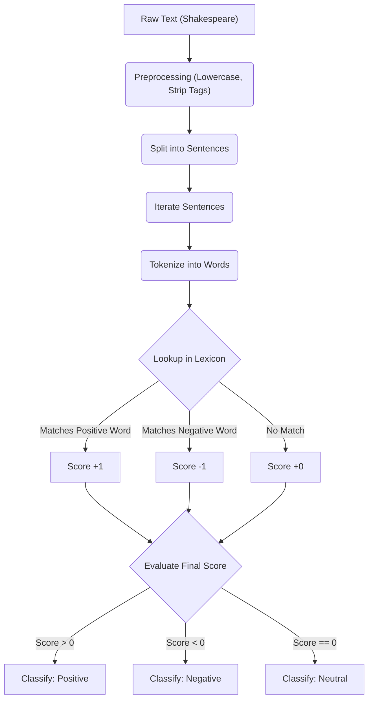

# Sentiment Analysis (v1: Basic Lexicon Approach)

## Overview
`sentiment_analysis.py` is a foundational Python script designed to perform basic, word-level sentiment analysis on text. This specific implementation analyzes a scene from Shakespeare's *Romeo and Juliet*. 

The script demonstrates the core concepts of Natural Language Processing (NLP) without relying on external machine learning libraries, using a brute-force approach to dictionary matching.

## Workflow



## Features
- **No External Dependencies:** Built entirely with Python's standard library. The only module used is `re` (Regular Expressions).
- **Custom Text Preprocessing:** Automatically strips out stage directions (e.g., `[Enter Romeo.]`) and character speech tags (e.g., `[Romeo.]:` or `Romeo:`).
- **Sentence Tokenization:** Splits large blocks of text into individual, distinct sentences based on standard punctuation `[.!?]`.
- **Hardcoded Lexicon:** Utilizes built-in Python lists containing predefined Positive and Negative words to score sentiment.

## How it Works
1. **Preprocessing:** The raw Shakespeare text is lowercased. Regular expressions remove brackets, stage directions, and speaker names. Finally, it splits the text into clean sentences.
2. **Analysis Loop:** For each sentence, the engine checks every single word. 
3. **Scoring:** 
   - If a word is found in the `positive_words` list, the sentence score increments by `+1`.
   - If a word is found in the `negative_words` list, the sentence score decrements by `-1`.
4. **Classification:**
   - **Score > 0:** Labeled as `Positive`
   - **Score < 0:** Labeled as `Negative`
   - **Score = 0:** Labeled as `Neutral`

## Limitations
This is an introductory approach and has several limitations typical of "bag-of-words" models:
- **No Contextual Awareness:** Cannot detect sarcasm or contextual meaning.
- **No Negation Handling:** A phrase like "not happy" will mistakenly be scored as positive because it simply matches the word "happy".
- **Strict String Matching:** Cannot match variations of words. If the text says "loved", it will not match the word "love".
- **Punctuation Sensitivity:** Words attached to unstripped punctuation (e.g., "sad,") may not correctly trigger a match in this version.

## Usage
Since all text and word lists are included directly within the file, simply run the script from your terminal:

```bash
python sentiment_analysis.py
```

The script will print an explanation of its method followed by a sentence-by-sentence breakdown of the analysis for the first 20 sentences.
