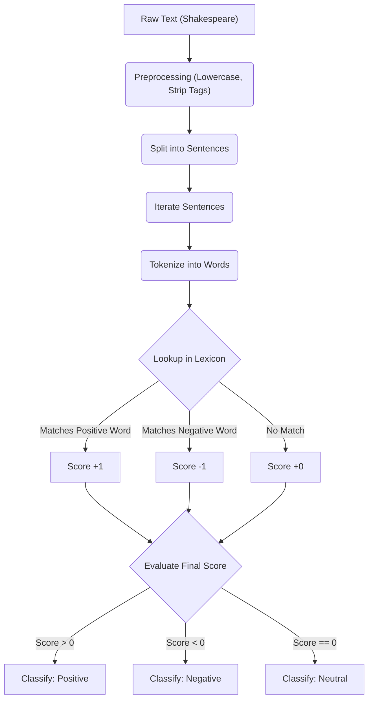
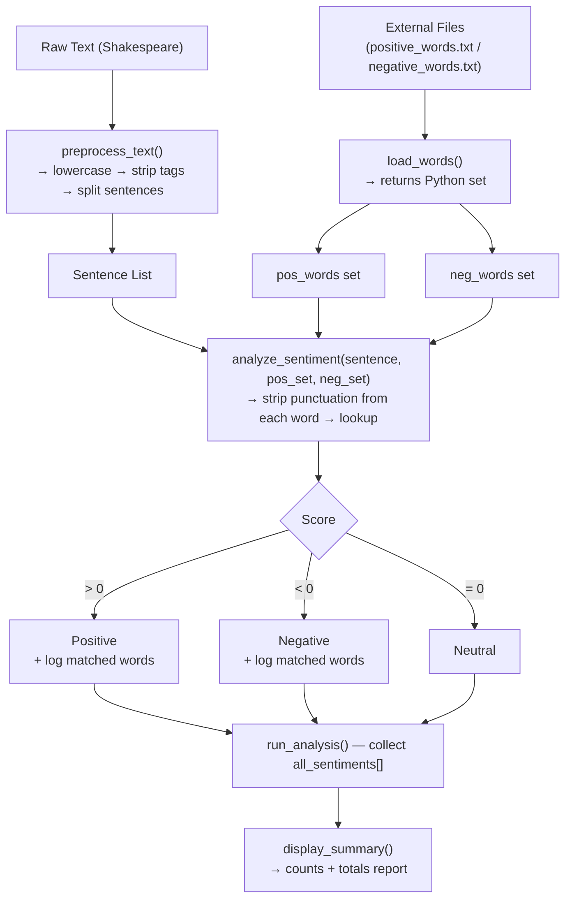

# Sentiment Analysis (v1: Basic Lexicon Approach)

## Overview

`sentiment_analysis.py` is a foundational Python script designed to perform basic, word-level sentiment analysis on text. This specific implementation analyzes a scene from Shakespeare's *Romeo and Juliet*.

The script demonstrates the core concepts of Natural Language Processing (NLP) without relying on external machine learning libraries, using a brute-force approach to dictionary matching.

## Workflow



## Features

- **No External Dependencies:** Built entirely with Python's standard library. The only module used is `re` (Regular Expressions).
- **Custom Text Preprocessing:** Automatically strips out stage directions (e.g., `[Enter Romeo.]`) and character speech tags (e.g., `[Romeo.]:` or `Romeo:`).
- **Sentence Tokenization:** Splits large blocks of text into individual, distinct sentences based on standard punctuation `[.!?]`.
- **Hardcoded Lexicon:** Utilizes built-in Python lists containing predefined Positive and Negative words to score sentiment.

## How it Works

1. **Preprocessing:** The raw Shakespeare text is lowercased. Regular expressions remove brackets, stage directions, and speaker names. Finally, it splits the text into clean sentences.
2. **Analysis Loop:** For each sentence, the engine checks every single word.
3. **Scoring:**
   - If a word is found in the `positive_words` list, the sentence score increments by `+1`.
   - If a word is found in the `negative_words` list, the sentence score decrements by `-1`.
4. **Classification:**
   - **Score > 0:** Labeled as `Positive`
   - **Score < 0:** Labeled as `Negative`
   - **Score = 0:** Labeled as `Neutral`

## Limitations

This is an introductory approach and has several limitations typical of "bag-of-words" models:

- **No Contextual Awareness:** Cannot detect sarcasm or contextual meaning.
- **No Negation Handling:** A phrase like "not happy" will mistakenly be scored as positive because it simply matches the word "happy".
- **Strict String Matching:** Cannot match variations of words. If the text says "loved", it will not match the word "love".
- **Punctuation Sensitivity:** Words attached to unstripped punctuation (e.g., "sad,") may not correctly trigger a match in this version.

## Usage

Since all text and word lists are included directly within the file, simply run the script from your terminal:

```bash
python sentiment_analysis.py
```

The script will print an explanation of its method followed by a sentence-by-sentence breakdown of the analysis for the first 20 sentences.

---

# Sentiment Analysis (v2: Modular + External Lexicon)

## Overview

`sentiment_v2.py` is a significant architectural upgrade over v1. It refactors the monolithic script into **clean, reusable functions** and replaces the hardcoded word lists with **external lexicon files** (`positive_words.txt` / `negative_words.txt`). This makes the analyser far more maintainable, extensible, and accurate.

The same Shakespeare balcony-scene text is analysed, but every stage of the pipeline is now an independently testable function, and lexicons can be swapped or expanded without touching the source code.

## Workflow



## Functions

| Function                                  | Responsibility                                                                                                                                                                       |
| ----------------------------------------- | ------------------------------------------------------------------------------------------------------------------------------------------------------------------------------------ |
| `load_words(file_path)`                 | Reads a `.txt` lexicon file; strips punctuation and lowercases every entry; returns a **set** for O(1) lookups. Gracefully skips missing files with a warning.               |
| `preprocess_text(text)`                 | Lowercases text, removes `[stage directions]` and `Speaker:` labels with regex, then splits on `.!?` into a clean sentence list.                                               |
| `analyze_sentiment(sentence, pos, neg)` | Iterates words, strips non-word chars with `re.sub`, looks up each word in the positive/negative sets, accumulates a score, and returns `(sentiment, matched_pos, matched_neg)`. |
| `display_summary(results)`              | Counts Positive / Negative / Neutral sentences and prints a formatted summary report.                                                                                                |
| `display_explanation()`                 | Prints a human-readable explanation of the analysis approach at startup.                                                                                                             |
| `run_analysis(text)`                    | **Orchestrator** — calls all of the above in the correct order and prints per-sentence results for the first 20 sentences.                                                    |

## How it Works

1. **Lexicon Loading:** `load_words()` reads `positive_words.txt` and `negative_words.txt`. Each word is cleaned with `re.sub(r'[^\w]', '', ...)` and lowercased, then stored in a Python `set` for fast membership testing.
2. **Preprocessing:** `preprocess_text()` lowercases the raw text, strips `[stage directions]` and `Speaker:` labels via regex, and returns a list of trimmed sentences.
3. **Word-level Scoring:** For each sentence, `analyze_sentiment()` tokenises by whitespace and strips residual punctuation from every token before the lexicon lookup — fixing the punctuation-sensitivity bug present in v1.
4. **Match Logging:** Every matched positive or negative word is collected and printed alongside the sentence, giving full transparency into why a sentence received its label.
5. **Summary Report:** After processing the first 20 sentences, `display_summary()` prints the aggregate counts and totals.

## Improvements Over v1

| Aspect                         | v1                                       | v2                                                         |
| ------------------------------ | ---------------------------------------- | ---------------------------------------------------------- |
| **Architecture**         | Single monolithic script                 | Modular functions with clear responsibilities              |
| **Lexicon**              | Hardcoded Python lists inside the script | External `.txt` files — swap words without editing code |
| **Lookup speed**         | `O(n)` list scan                       | `O(1)` set lookup                                        |
| **Punctuation handling** | Words not cleaned before lookup (bug)    | `re.sub` cleans every token before matching              |
| **Transparency**         | Score only                               | Score + lists of matched positive/negative words           |
| **Summary**              | None                                     | Per-run summary report with counts and totals              |
| **Extensibility**        | Must edit source code to change lexicons | Edit `.txt` files only                                   |

## Limitations

- Inherits the same **no-context** and **no-negation-handling** limitations as v1 (addressed in v3 with VADER).
- **External file dependency:** Requires `positive_words.txt` and `negative_words.txt` to be present in the working directory.
- Still analyses only the first 20 sentences.

## Usage

Ensure the external lexicon files exist in the same directory, then run:

```bash
python sentiment_v2.py
```

The script will:

1. Print the approach explanation.
2. Load lexicons from `positive_words.txt` and `negative_words.txt`.
3. Print a sentence-by-sentence sentiment breakdown for the first 20 sentences, including matched trigger words.
4. Print an aggregate **Sentiment Summary Report**.
